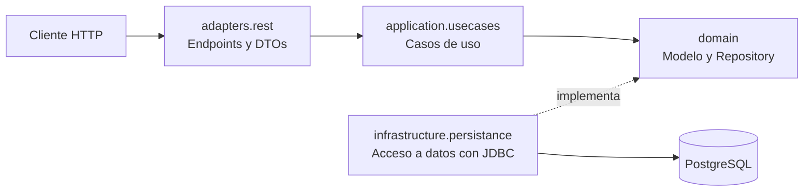

# API REST de Canciones con Quarkus

API REST para gestionar un catálogo de canciones (consultar, crear, modificar y eliminar), desarrollada con **Java**, **Quarkus** y **PostgreSQL** y organizada siguiendo una **arquitectura hexagonal**.

## Contexto

Desarrollé este proyecto para preparar el **primer examen parcial** de la asignatura **Desarrollo y Administración de Sistemas de Información** (DASI), de 3.º de Ingeniería Informática en la Universidad Pontificia de Salamanca (curso 2025/26).

En ese examen obtuve un **10**, y en el conjunto de la asignatura, **Matrícula de Honor**.

Es el primero de tres proyectos de estudio de la asignatura, cada uno preparado para un examen:

1. **Primer parcial** (este proyecto): API REST con arquitectura hexagonal y acceso a datos con JDBC.
2. [Segundo parcial](https://github.com/AdrianRubioSevillano/coches-microservicios-jakarta-quarkus): microservicios con Jakarta EE y Quarkus, validación de datos y gestión de errores entre servicios.
3. Examen global (próximamente)

## Tecnologías

| Área | Tecnología |
|---|---|
| Lenguaje | Java 21 |
| Framework | Quarkus 3.27 (Quarkus REST, inyección de dependencias con CDI) |
| Base de datos | PostgreSQL 18 |
| Acceso a datos | JDBC con `PreparedStatement` y pool de conexiones Agroal |
| Contenedores | Docker y Docker Compose |
| Conversión entre capas | MapStruct |
| Reducción de código repetitivo | Lombok |
| Gestión del proyecto | Maven |

## Arquitectura

El código está dividido en capas, de forma que la lógica de la aplicación no depende ni de la API REST ni de la base de datos:



| Capa | Qué contiene |
|---|---|
| `adapters.rest` | Los endpoints de la API, los objetos de entrada y salida (DTOs) y un conversor propio para recibir varios ids en una sola petición (`?id=1:3:5`) |
| `application.usecases` | Un caso de uso por cada operación: buscar, insertar, actualizar, eliminar... |
| `domain` | El modelo de `Cancion` y la interfaz `Repository`, que define qué operaciones existen sin decir cómo se hacen |
| `infrastructure.persistance` | La implementación del repositorio, con las consultas SQL a PostgreSQL |

Cada capa trabaja con sus propios objetos, y la conversión entre ellos se hace automáticamente con MapStruct.

## Estructura del proyecto

```
.
├── docker-compose.yml        # Base de datos PostgreSQL en Docker
├── database.sql              # Creación de la tabla y datos de ejemplo
├── request.http              # Peticiones de ejemplo para probar la API
└── quarkus-canciones/        # Código de la aplicación
    └── src/main/java/es/upsa/dasi/quarkuscanciones/
        ├── adapters/rest/
        ├── application/usecases/
        ├── domain/
        └── infrastructure/persistance/
```

## Cómo ejecutarlo

### Requisitos

- Java 21
- Docker

No hace falta instalar Maven ni PostgreSQL: el proyecto incluye Maven Wrapper y la base de datos se levanta con Docker.

### Pasos

**1. Clonar el repositorio**

```bash
git clone https://github.com/<tu-usuario>/<nombre-del-repo>.git
cd <nombre-del-repo>
```

**2. Levantar la base de datos**

```bash
docker compose up -d
```

Docker descarga PostgreSQL, crea la base de datos y ejecuta `database.sql`, que crea la tabla y añade 5 canciones de ejemplo.

**3. Arrancar la aplicación**

```bash
cd quarkus-canciones
./mvnw quarkus:dev
```

La API queda disponible en `http://localhost:8080/canciones`.

**4. Apagar la base de datos** (desde la carpeta raíz, cuando termines)

```bash
docker compose down
```

> **Nota:** si ya tienes PostgreSQL instalado en tu equipo y encendido, apágalo antes del paso 2, porque ambos usan el puerto 5432.

### Credenciales

El usuario y la contraseña de la base de datos (`postgres` / `postgres`) son valores de prueba para la base de datos local que crea Docker. Para conectar la aplicación a otra base de datos, se pueden indicar otros mediante las variables de entorno `DB_USER` y `DB_PASSWORD`, sin modificar el código.

## Endpoints

| Método | Ruta | Descripción | Respuesta |
|---|---|---|---|
| `GET` | `/canciones` | Lista todas las canciones, ordenadas por duración | `200` |
| `GET` | `/canciones?id=1:3:5` | Lista solo las canciones con esos ids, separados por `:` | `200` |
| `GET` | `/canciones/{id}` | Muestra el detalle de una canción | `200` / `404` |
| `POST` | `/canciones` | Crea una canción | `201` |
| `POST` | `/canciones/several` | Crea varias canciones en una sola petición | `200` |
| `PUT` | `/canciones/{id}` | Modifica los datos de una canción | `200` / `404` |
| `DELETE` | `/canciones/{id}` | Elimina una canción | `204` / `404` |

### Ejemplo: crear una canción

**Petición**

```http
POST http://localhost:8080/canciones
Content-Type: application/json

{
  "titulo": "Provenza",
  "artista": "Karol G",
  "album": "Mañana Será Bonito",
  "duracion": 210,
  "fechaEstreno": "2022-04-21"
}
```

**Respuesta:** `201 Created`. Incluye la cabecera `Location` con la dirección de la nueva canción (por ejemplo, `http://localhost:8080/canciones/10`) y el cuerpo:

```json
{
  "id": "10",
  "titulo": "Provenza",
  "artista": "Karol G",
  "album": "Mañana Será Bonito",
  "duracion": 210,
  "fechaEstreno": "2022-04-21"
}
```

El archivo [`request.http`](request.http) contiene ejemplos de todas las peticiones, listos para ejecutar desde IntelliJ IDEA o desde VS Code con la extensión REST Client.

## Próximos pasos

Al ser el proyecto del primer parcial, se centra en la arquitectura y el acceso a datos. Algunos aspectos que no cubre los trabajé en los proyectos de los siguientes exámenes:

- Validación de los datos de entrada.
- Gestión de errores con respuestas HTTP específicas.
- Transacciones en las operaciones que modifican varios registros.
- Tests automatizados.

## Autor

**Adrián Rubio Sevillano**: estudiante de Ingeniería Informática en la Universidad Pontificia de Salamanca.

[LinkedIn](https://www.linkedin.com/in/adrian-rubio-sevillano)
